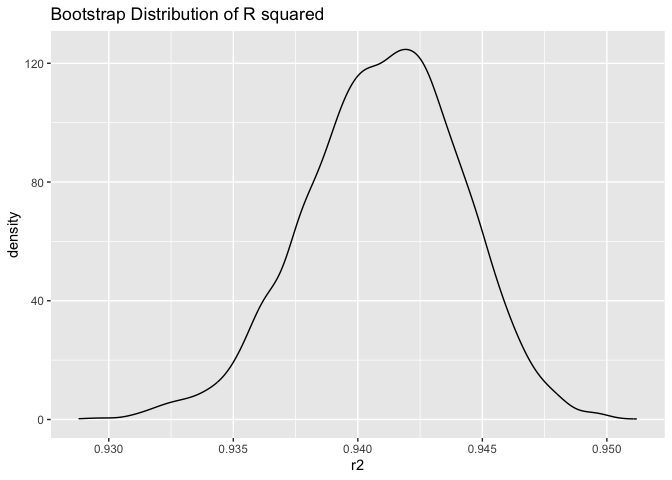
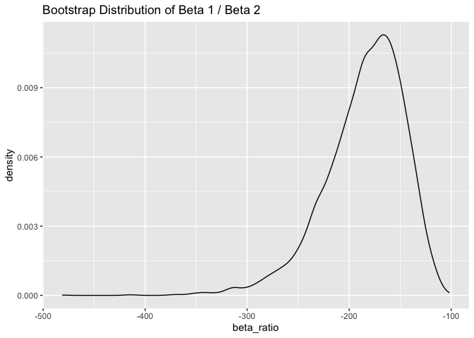
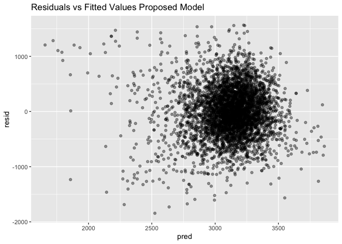
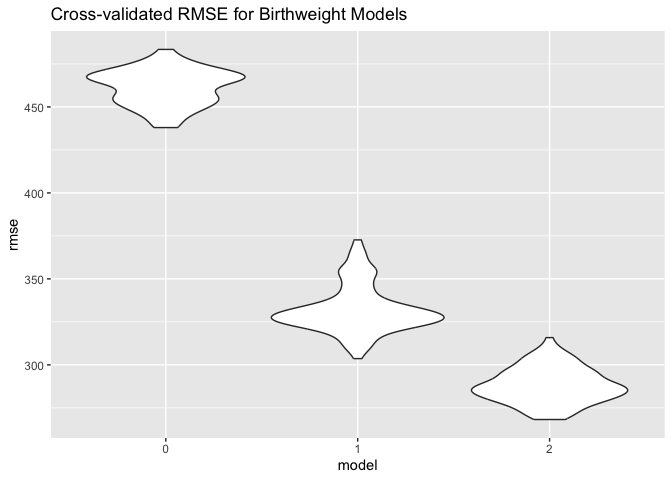

p8105_hw6_mt3866
================
2025-11-17

Load libraries

``` r
library(tidyverse)
```

    ## ── Attaching core tidyverse packages ──────────────────────── tidyverse 2.0.0 ──
    ## ✔ dplyr     1.1.4     ✔ readr     2.1.5
    ## ✔ forcats   1.0.0     ✔ stringr   1.5.1
    ## ✔ ggplot2   3.5.2     ✔ tibble    3.3.0
    ## ✔ lubridate 1.9.4     ✔ tidyr     1.3.1
    ## ✔ purrr     1.1.0     
    ## ── Conflicts ────────────────────────────────────────── tidyverse_conflicts() ──
    ## ✖ dplyr::filter() masks stats::filter()
    ## ✖ dplyr::lag()    masks stats::lag()
    ## ℹ Use the conflicted package (<http://conflicted.r-lib.org/>) to force all conflicts to become errors

``` r
library(broom)
library(modelr)
```

    ## 
    ## Attaching package: 'modelr'
    ## 
    ## The following object is masked from 'package:broom':
    ## 
    ##     bootstrap

### Problem 1

Import data, and create city_state column, exclude 4 cities, only
include White & Black, ensure age is numeric:

``` r
  homicides = read_csv("homicide-data.csv")|>
  janitor::clean_names()|>
  mutate(city_state = str_c(city, state, sep = ","),
    solved = if_else(disposition == "Closed by arrest", 1, 0),
        victim_age = as.numeric(victim_age)
  ) |>
  filter(!city_state %in% c("Dallas,TX", "Phoenix,AZ", "Kansas City,MO", "Tulsa,AL"))|>
  filter(victim_race %in% c("White", "Black"))
```

    ## Rows: 52179 Columns: 12
    ## ── Column specification ────────────────────────────────────────────────────────
    ## Delimiter: ","
    ## chr (9): uid, victim_last, victim_first, victim_race, victim_age, victim_sex...
    ## dbl (3): reported_date, lat, lon
    ## 
    ## ℹ Use `spec()` to retrieve the full column specification for this data.
    ## ℹ Specify the column types or set `show_col_types = FALSE` to quiet this message.

    ## Warning: There was 1 warning in `mutate()`.
    ## ℹ In argument: `victim_age = as.numeric(victim_age)`.
    ## Caused by warning:
    ## ! NAs introduced by coercion

Use glm to fit logistic regression, obtain adjusted OR:

``` r
baltimore_lr = homicides |>
  filter(city_state == "Baltimore,MD")

balt_model = glm(
  solved ~ victim_age + victim_sex + victim_race,
  data = baltimore_lr,
  family = binomial
)

balt_tidy = tidy(balt_model, exponentiate = TRUE, conf.int = TRUE)
balt_tidy
```

    ## # A tibble: 4 × 7
    ##   term             estimate std.error statistic  p.value conf.low conf.high
    ##   <chr>               <dbl>     <dbl>     <dbl>    <dbl>    <dbl>     <dbl>
    ## 1 (Intercept)         1.36    0.171        1.81 7.04e- 2    0.976     1.91 
    ## 2 victim_age          0.993   0.00332     -2.02 4.30e- 2    0.987     1.000
    ## 3 victim_sexMale      0.426   0.138       -6.18 6.26e-10    0.324     0.558
    ## 4 victim_raceWhite    2.32    0.175        4.82 1.45e- 6    1.65      3.28

``` r
balt_or_for_male <- balt_tidy |>
  filter(term == "victim_sexMale")

balt_or_for_male
```

    ## # A tibble: 1 × 7
    ##   term           estimate std.error statistic  p.value conf.low conf.high
    ##   <chr>             <dbl>     <dbl>     <dbl>    <dbl>    <dbl>     <dbl>
    ## 1 victim_sexMale    0.426     0.138     -6.18 6.26e-10    0.324     0.558

Model for all cities, extract adjusted OR:

``` r
city_models = homicides |>
  group_by(city_state) |>
  nest() |>
  mutate(
    model = map(data, ~ glm(
      solved ~ victim_age + victim_sex + victim_race,
      data = .x,
      family = binomial
    )),
    results = map(model, ~ tidy(.x, exponentiate = TRUE, conf.int = TRUE))
  ) |>
  unnest(results)
```

    ## Warning: There were 43 warnings in `mutate()`.
    ## The first warning was:
    ## ℹ In argument: `results = map(model, ~tidy(.x, exponentiate = TRUE, conf.int =
    ##   TRUE))`.
    ## ℹ In group 1: `city_state = "Albuquerque,NM"`.
    ## Caused by warning:
    ## ! glm.fit: fitted probabilities numerically 0 or 1 occurred
    ## ℹ Run `dplyr::last_dplyr_warnings()` to see the 42 remaining warnings.

``` r
city_or = city_models |>
  filter(term == "victim_sexMale") |>
  select(city_state, estimate, conf.low, conf.high)

city_or
```

    ## # A tibble: 47 × 4
    ## # Groups:   city_state [47]
    ##    city_state     estimate conf.low conf.high
    ##    <chr>             <dbl>    <dbl>     <dbl>
    ##  1 Albuquerque,NM    1.77     0.825     3.76 
    ##  2 Atlanta,GA        1.00     0.680     1.46 
    ##  3 Baltimore,MD      0.426    0.324     0.558
    ##  4 Baton Rouge,LA    0.381    0.204     0.684
    ##  5 Birmingham,AL     0.870    0.571     1.31 
    ##  6 Boston,MA         0.674    0.353     1.28 
    ##  7 Buffalo,NY        0.521    0.288     0.936
    ##  8 Charlotte,NC      0.884    0.551     1.39 
    ##  9 Chicago,IL        0.410    0.336     0.501
    ## 10 Cincinnati,OH     0.400    0.231     0.667
    ## # ℹ 37 more rows

Plot showing OR and CI for each city

``` r
city_or_plot = city_or |>
  arrange(estimate) |>
  mutate(city_state = factor(city_state, levels = city_state))

ggplot(city_or_plot, aes(x = city_state, y = estimate)) +
  geom_point() +
  geom_errorbar(aes(ymin = conf.low, ymax = conf.high), width = 0) +
  labs(
    title = "Adjusted Odds of Solved Homicides for Male vs Female Victims",
    x = "City",
    y = "Adjusted OR for Male vs Female Victims"
  ) +
  theme(axis.text.x = element_text(angle = 90, hjust = 1))
```

<!-- -->

Comment: The widest 95% CI for the adjusted odds ratio is for the city
Albuquerque, NM while the smallest 95% CI for the adjusted odds ratio is
for Chicago, IL. The confidence intervals vary widely between the
different cities. The city with the highest adjusted odds ratio of
solved homicides for males compared to females is in Albuquerque, NM,
while the second highest is in Stockton, CA, and the third highest is
Fresno, CA.

### Problem 2

Import data

``` r
library(p8105.datasets)
data("weather_df")
```

Define linear function

``` r
boot_stat = function(df) {
  
  fit = lm(tmax ~ tmin + prcp, data = df)
  
  r2 = glance(fit)$r.squared
  
  coefs = tidy(fit) |>
    filter(term %in% c("tmin", "prcp")) 
  
  beta1 = coefs$estimate[coefs$term == "tmin"]
  beta2 = coefs$estimate[coefs$term == "prcp"]
  
  ratio = beta1 / beta2
  
  tibble(r2 = r2, beta_ratio = ratio)
}
```

Run 5,000 bootstrap samples

``` r
bootstrap_results = tibble(i = 1:5000) |>
  mutate(
    sample = map(i, ~ sample_frac(weather_df, replace = TRUE)),
    stats = map(sample, boot_stat)
  ) |>
  select(stats) |>
  unnest(stats)
```

Plot distribution of estimates

``` r
bootstrap_results |>
  ggplot(aes(r2)) +
  geom_density() +
  labs(title = "Bootstrap Distribution of R squared")
```

<!-- -->

``` r
bootstrap_results |>
  ggplot(aes(beta_ratio)) +
  geom_density() +
  labs(title = "Bootstrap Distribution of Beta 1 / Beta 2")
```

<!-- -->
Description: The bootstrap distribution of Beta 1/Beta 2 is left skewed,
while the bootstrap distribution of R squared is in the shape of a bell
curve.

Identify quantiles, compute 95% CI

``` r
bootstrap_results |>
  summarize(
    lower = quantile(r2, 0.025),
    upper = quantile(r2, 0.975)
  )
```

    ## # A tibble: 1 × 2
    ##   lower upper
    ##   <dbl> <dbl>
    ## 1 0.935 0.947

``` r
bootstrap_results |>
  summarize(
    lower = quantile(beta_ratio, 0.025),
    upper = quantile(beta_ratio, 0.975)
  )
```

    ## # A tibble: 1 × 2
    ##   lower upper
    ##   <dbl> <dbl>
    ## 1 -278. -126.

### Problem 3

Import and clean data

``` r
bw_df = read_csv("birthweight.csv") |>
  mutate(
    babysex = factor(babysex),
    frace   = factor(frace),
    mrace   = factor(mrace),
    malform = factor(malform),
    babysex = factor(babysex, labels = c("male", "female"))
    )|>
  janitor::clean_names()
```

    ## Rows: 4342 Columns: 20
    ## ── Column specification ────────────────────────────────────────────────────────
    ## Delimiter: ","
    ## dbl (20): babysex, bhead, blength, bwt, delwt, fincome, frace, gaweeks, malf...
    ## 
    ## ℹ Use `spec()` to retrieve the full column specification for this data.
    ## ℹ Specify the column types or set `show_col_types = FALSE` to quiet this message.

Proposed model

``` r
proposed_model = lm(
  bwt ~ gaweeks + fincome + smoken + pnumlbw + momage,
  data = bw_df
)
summary(proposed_model)
```

    ## 
    ## Call:
    ## lm(formula = bwt ~ gaweeks + fincome + smoken + pnumlbw + momage, 
    ##     data = bw_df)
    ## 
    ## Residuals:
    ##      Min       1Q   Median       3Q      Max 
    ## -1844.05  -284.79    -4.25   290.14  1565.76 
    ## 
    ## Coefficients: (1 not defined because of singularities)
    ##             Estimate Std. Error t value Pr(>|t|)    
    ## (Intercept) 333.7676    91.6438   3.642 0.000274 ***
    ## gaweeks      64.5878     2.2318  28.940  < 2e-16 ***
    ## fincome       1.9463     0.2849   6.832 9.54e-12 ***
    ## smoken       -7.1028     0.9458  -7.509 7.17e-14 ***
    ## pnumlbw           NA         NA      NA       NA    
    ## momage        8.7581     1.9094   4.587 4.63e-06 ***
    ## ---
    ## Signif. codes:  0 '***' 0.001 '**' 0.01 '*' 0.05 '.' 0.1 ' ' 1
    ## 
    ## Residual standard error: 459.4 on 4337 degrees of freedom
    ## Multiple R-squared:  0.196,  Adjusted R-squared:  0.1953 
    ## F-statistic: 264.3 on 4 and 4337 DF,  p-value: < 2.2e-16

I decided to include these variables in my model because after
researching things that may be associated with low birth weight in
babies, I found that gestational age in weeks, socioeconomic status,
smoking history, preview number of low birthweight babies, and the mom’s
age are related. Therefore, I included these factors in my model.

Plot of model residuals against fitted values

``` r
bw_df |>
  add_predictions(proposed_model) |>
  add_residuals(proposed_model) |>
  ggplot(aes(x = pred, y = resid)) +
  geom_point(alpha = 0.4) +
  labs(title = "Residuals vs Fitted Values Proposed Model")
```

<!-- -->

Comparison models

``` r
mod_1 = lm(bwt ~ blength + gaweeks, data = bw_df)

mod_2 = lm(
  bwt ~ bhead * blength * babysex,
  data = bw_df
)
```

Cross validation

``` r
cv_df = 
  crossv_mc(bw_df, n = 100) |>
  mutate(
    train = map(train, as_tibble),
    test = map(test, as_tibble)
  )
```

Fit all 3

``` r
cv_results = cv_df |>
  mutate(
    mod_0   = map(train, \(df) lm(bwt ~ gaweeks + fincome + smoken + pnumlbw + momage, data = df)),
    mod_1    = map(train, \(df) lm(bwt ~ blength + gaweeks, data = df)),
    mod_2    = map(train, \(df) lm(bwt ~ bhead * blength * babysex, data = df))
  ) |>
  mutate(
    rmse_0 = map2_dbl(mod_0, test, rmse),
    rmse_1  = map2_dbl(mod_1, test, rmse),
    rmse_2  = map2_dbl(mod_2, test, rmse)
  )
```

Violin plots to compare cross validation prediction error

``` r
cv_results |>
  select(starts_with("rmse")) |>
  pivot_longer(
    everything(),
    names_to = "model",
    values_to = "rmse",
    names_prefix = "rmse_"
  ) |>
  ggplot(aes(x = model, y = rmse)) +
  geom_violin() +
  labs(title = "Cross-validated RMSE for Birthweight Models")
```

<!-- -->
