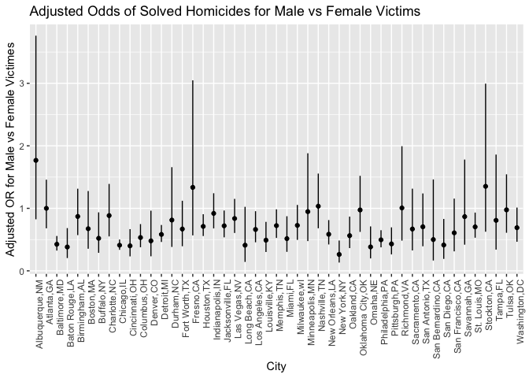

p8105_hw6_mt3866
================
2025-11-17

Load libraries

``` r
library(tidyverse)
```

    ## ── Attaching core tidyverse packages ──────────────────────── tidyverse 2.0.0 ──
    ## ✔ dplyr     1.1.4     ✔ readr     2.1.5
    ## ✔ forcats   1.0.0     ✔ stringr   1.5.1
    ## ✔ ggplot2   3.5.2     ✔ tibble    3.3.0
    ## ✔ lubridate 1.9.4     ✔ tidyr     1.3.1
    ## ✔ purrr     1.1.0     
    ## ── Conflicts ────────────────────────────────────────── tidyverse_conflicts() ──
    ## ✖ dplyr::filter() masks stats::filter()
    ## ✖ dplyr::lag()    masks stats::lag()
    ## ℹ Use the conflicted package (<http://conflicted.r-lib.org/>) to force all conflicts to become errors

``` r
library(broom)
```

### Problem 1

Import data, and create city_state column, exclude 4 cities, only
include White & Black, ensure age is numeric:

``` r
  homicides = read_csv("homicide-data.csv")|>
  janitor::clean_names()|>
  mutate(city_state = str_c(city, state, sep = ","),
    solved = if_else(disposition == "Closed by arrest", 1, 0),
        victim_age = as.numeric(victim_age)
  ) |>
  filter(!city_state %in% c("Dallas,TX", "Phoenix,AZ", "Kansas City,MO", "Tulsa,AL"))|>
  filter(victim_race %in% c("White", "Black"))
```

    ## Rows: 52179 Columns: 12
    ## ── Column specification ────────────────────────────────────────────────────────
    ## Delimiter: ","
    ## chr (9): uid, victim_last, victim_first, victim_race, victim_age, victim_sex...
    ## dbl (3): reported_date, lat, lon
    ## 
    ## ℹ Use `spec()` to retrieve the full column specification for this data.
    ## ℹ Specify the column types or set `show_col_types = FALSE` to quiet this message.

    ## Warning: There was 1 warning in `mutate()`.
    ## ℹ In argument: `victim_age = as.numeric(victim_age)`.
    ## Caused by warning:
    ## ! NAs introduced by coercion

Use glm to fit logistic regression, obtain adjusted OR:

``` r
baltimore_lr = homicides |>
  filter(city_state == "Baltimore,MD")

balt_model = glm(
  solved ~ victim_age + victim_sex + victim_race,
  data = baltimore_lr,
  family = binomial
)

balt_tidy = tidy(balt_model, exponentiate = TRUE, conf.int = TRUE)
balt_tidy
```

    ## # A tibble: 4 × 7
    ##   term             estimate std.error statistic  p.value conf.low conf.high
    ##   <chr>               <dbl>     <dbl>     <dbl>    <dbl>    <dbl>     <dbl>
    ## 1 (Intercept)         1.36    0.171        1.81 7.04e- 2    0.976     1.91 
    ## 2 victim_age          0.993   0.00332     -2.02 4.30e- 2    0.987     1.000
    ## 3 victim_sexMale      0.426   0.138       -6.18 6.26e-10    0.324     0.558
    ## 4 victim_raceWhite    2.32    0.175        4.82 1.45e- 6    1.65      3.28

``` r
balt_or_for_male <- balt_tidy |>
  filter(term == "victim_sexMale")

balt_or_for_male
```

    ## # A tibble: 1 × 7
    ##   term           estimate std.error statistic  p.value conf.low conf.high
    ##   <chr>             <dbl>     <dbl>     <dbl>    <dbl>    <dbl>     <dbl>
    ## 1 victim_sexMale    0.426     0.138     -6.18 6.26e-10    0.324     0.558

Model for all cities, extract adjusted OR:

``` r
city_models = homicides |>
  group_by(city_state) |>
  nest() |>
  mutate(
    model = map(data, ~ glm(
      solved ~ victim_age + victim_sex + victim_race,
      data = .x,
      family = binomial
    )),
    results = map(model, ~ tidy(.x, exponentiate = TRUE, conf.int = TRUE))
  ) |>
  unnest(results)
```

    ## Warning: There were 43 warnings in `mutate()`.
    ## The first warning was:
    ## ℹ In argument: `results = map(model, ~tidy(.x, exponentiate = TRUE, conf.int =
    ##   TRUE))`.
    ## ℹ In group 1: `city_state = "Albuquerque,NM"`.
    ## Caused by warning:
    ## ! glm.fit: fitted probabilities numerically 0 or 1 occurred
    ## ℹ Run `dplyr::last_dplyr_warnings()` to see the 42 remaining warnings.

``` r
city_or = city_models |>
  filter(term == "victim_sexMale") |>
  select(city_state, estimate, conf.low, conf.high)

city_or
```

    ## # A tibble: 47 × 4
    ## # Groups:   city_state [47]
    ##    city_state     estimate conf.low conf.high
    ##    <chr>             <dbl>    <dbl>     <dbl>
    ##  1 Albuquerque,NM    1.77     0.825     3.76 
    ##  2 Atlanta,GA        1.00     0.680     1.46 
    ##  3 Baltimore,MD      0.426    0.324     0.558
    ##  4 Baton Rouge,LA    0.381    0.204     0.684
    ##  5 Birmingham,AL     0.870    0.571     1.31 
    ##  6 Boston,MA         0.674    0.353     1.28 
    ##  7 Buffalo,NY        0.521    0.288     0.936
    ##  8 Charlotte,NC      0.884    0.551     1.39 
    ##  9 Chicago,IL        0.410    0.336     0.501
    ## 10 Cincinnati,OH     0.400    0.231     0.667
    ## # ℹ 37 more rows

Plot showing OR and CI for each city

``` r
city_or_plot = city_or |>
  arrange(estimate) |>
  mutate(city_state = factor(city_state, levels = city_state))

ggplot(city_or_plot, aes(x = city_state, y = estimate)) +
  geom_point() +
  geom_errorbar(aes(ymin = conf.low, ymax = conf.high), width = 0) +
  labs(
    title = "Adjusted Odds of Solved Homicides for Male vs Female Victims",
    x = "City",
    y = "Adjusted OR for Male vs Female Victimes"
  ) +
  theme(axis.text.x = element_text(angle = 90, hjust = 1))
```

<!-- -->
